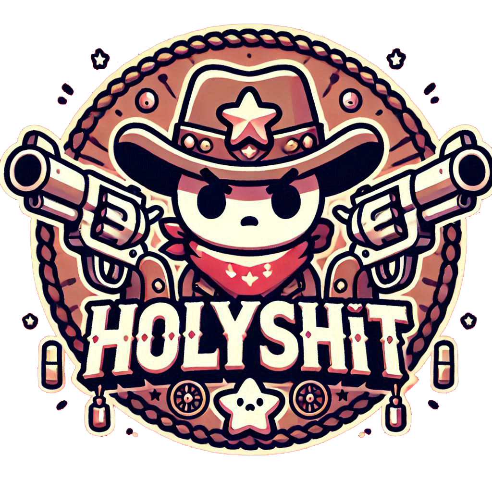
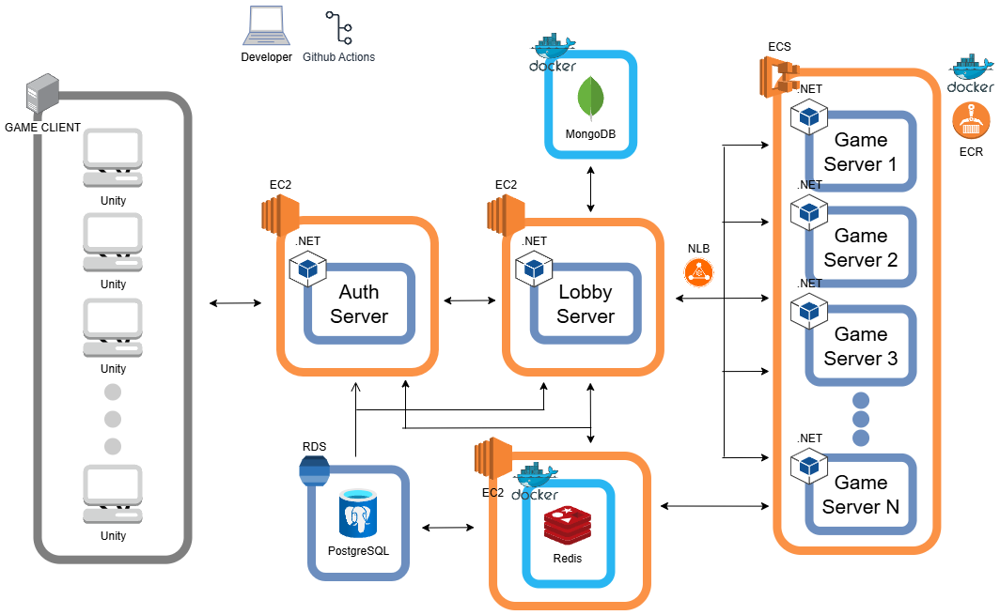

# dotnet-holyshit-lobby-server

# Holy Shit

  

## 프로젝트 소개

- 게임명: Holy Shit!
- 프로젝트 기간: 2024.12 ~ 2025.02
- 게임 장르: 전략/카드
- 프로젝트 소개: **Holy Shit!**은 보드 게임 Bang!에서 영감을 받은 실시간 전략 카드 게임입니다. 각 플레이어는 숨겨진 역할에 따라 목표를 달성해야 하며, 승리를 위해 치열한 심리전과 전략적인 플레이가 요구됩니다.

- 프로젝트 문서는 [여기](https://dune-poultry-b4f.notion.site/Holy-Shit-18a266df1491805dbb78c9ed6f672c5d?pvs=4)에서 확인하실 수 있습니다!

## 서비스 아키텍처

  

## 기술 구현

<b>Programming Languages</b>
 

 
<b>Socket Programming</b>
 

 
<b>Game Server & Login Server</b>
 

 
<b>Pathfinding Server</b>
 

 
<b>Client</b>
 

 
<b>DB</b>
 

 
<b>DevOps</b>
 

 
<b>VCS (Virsion Control System)</b>
 

 
